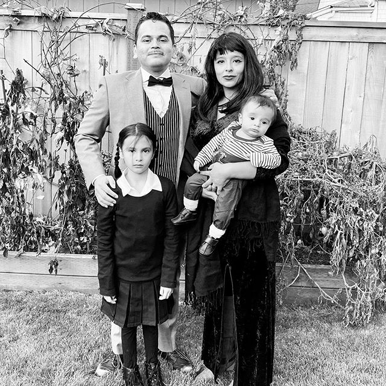

Hello Dwell Development,

Thank you very much for considering our family's offer to purchase [6423 Flora Ave S](https://www.dwelldevelopment.com/portfolio/georgetown-single-family/) in the Georgetown neighborhood. My wife and I, along with our two kids, live in Georgetown and are impressed with the build quality and presence of your beautiful homes in our neighborhood. I am also deeply impressed by your company's commitment to sustainable development. On our near-daily walks down Flora we always stop to admire the construction site. We peek through the green curtains on the fence and marvel at the progress being made. We whisper to each other imagined scenarios of a happy and bright future of our family inside the completed house.

We moved to Georgetown in 2018 and feel very fortunate to be a part of this unique, diverse, and engaged community. We have been active and dedicated neighbors, working with GT families to lobby the Seattle School Board to grandfather current Georgetown kids into Maple Elementary School before a planned rezoning this year. As a board member of the [Georgetown Community Council](https://www.georgetowncommunitycouncil.com/) I helped organize an [effort](https://www.change.org/p/king-county-executive-dow-constantine-relocate-sobriety-center-outside-of-the-georgetown-community?redirect=false) to succesfully challenge the relocation of a sobriety center into Georgetown in 2019. Along with neighbors and community leaders I've testified before the City Council for more sustainable pathways for bikes and pedestrians in the neighborhood, an issue that becomes more urgent with the West Seattle bridge closure. As an admin for the [Georgetown Community Facebook Group](https://www.facebook.com/groups/GeorgetownCommunity/), I help maintain an informative, safe and inclusive space for our 1,012 active members. When i'm not spending time in my community i'm [managing a team of software engineers at Amazon](https://www.linkedin.com/in/martco/), where we are building the future of grocery shopping for customers worldwide.

  <i>Our family as The Addams Family, Halloween 2019, on Flora</i>

Our family grew to 4 when Marty Jr. (or Pugsley, above) was born last May. We are now exploring opportunities to better accomodate our newest member while also maintaining our close-ties and commitment to the neighborhood. 6423 Flora, with its compelling and modern architecture, light-embracing structure, thoughtful build components, and proximity to many cherished friends and neighbors, is the only home we have seriously considered. Thank you very much for your commitment to developing high-quality, sustainable homes in our neighborhood and for considering our offer to purchase. We would be proud and honored owners of your home.

Regards,

Marty & Ivette Cortez
